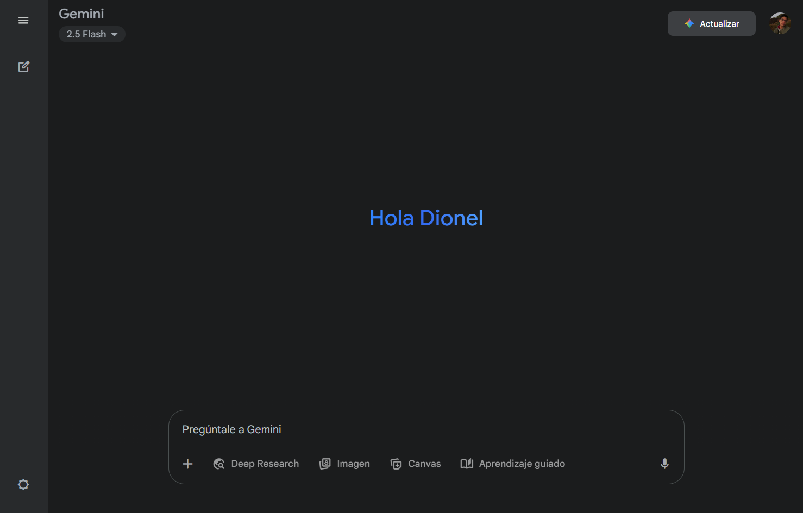
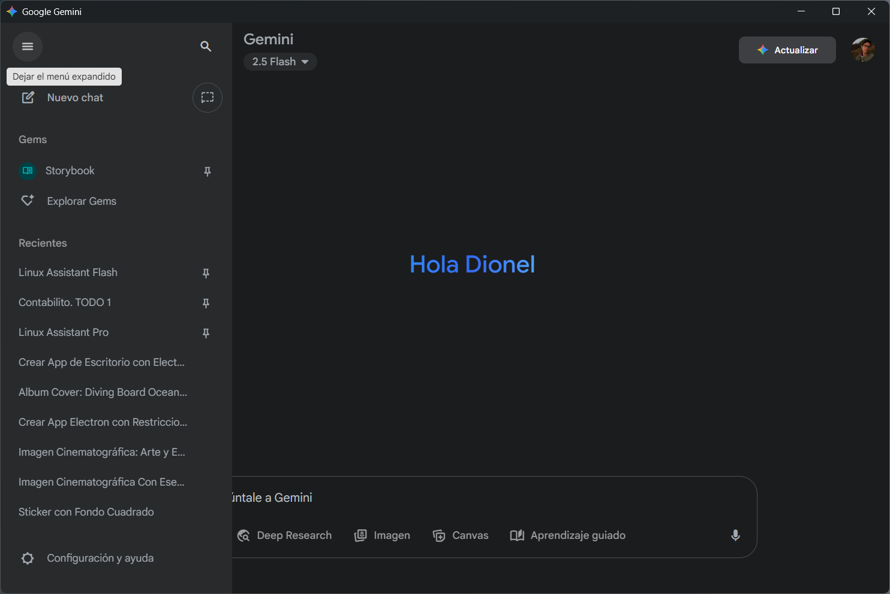
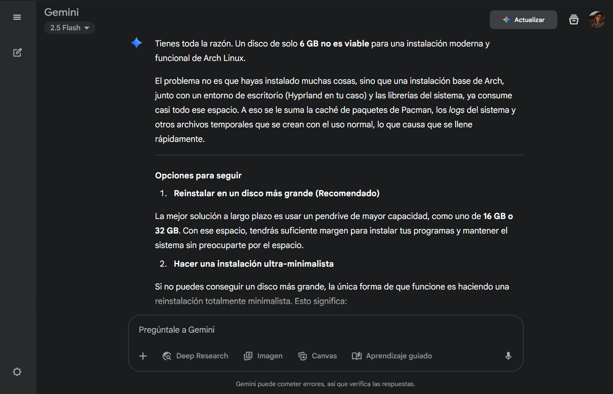
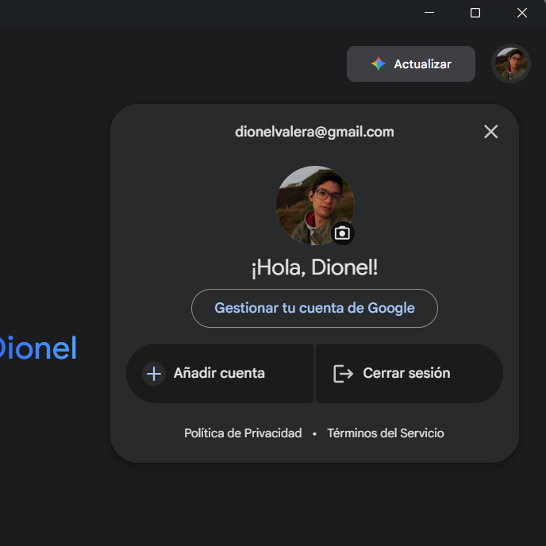
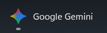
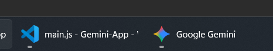
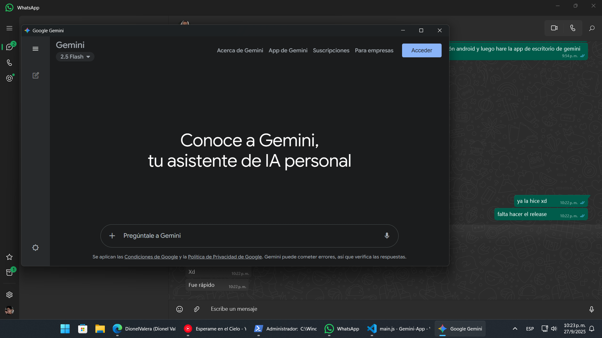

# Gemini Desktop AI

         

¡Hola a todos! Me emociona anunciar la primera versión estable de **Gemini Desktop AI**, una aplicación de escritorio diseñada para ofrecerte la mejor experiencia de interacción con la famosa inteligencia artificial Gemini.

Esta aplicación envuelve la web de Gemini en un entorno dedicado de escritorio (Electron), asegurando una experiencia de usuario limpia, dedicada y sin distracciones.

---

## ✨ Características Principales

* **Interfaz sin distracciones:** Ventana nativa para integración perfecta en el escritorio (Windows/Linux).
* **Controles funcionales:** Botones de minimizar, maximizar y cerrar provistos por el sistema operativo.
* **Redirecciones y ventanas emergentes:** Todo se abre dentro de la propia aplicación Electron, manteniendo la experiencia centralizada y sin perder el foco en Gemini.
* **Rendimiento optimizado:** Construido sobre la base rápida de Electron.

---

## 📸 Capturas de Pantalla

    

        
        
    

    

        
        
    

    

        
        
    

    

        
    

---

## ⬇️ Descargas

Descarga el instalador correspondiente a tu sistema operativo.  
↓↓↓↓↓↓↓↓ 
[Ultimas Versiones]](https://github.com/DionelValera/gemini-desktop/releases/tag/stable-release)

### 💻 Windows

* **Instalador:**
[Gemini setup 1.0.exe](https://github.com/DionelValera/gemini-desktop/releases/download/stable-release/Gemini.Setup.1.0.exe)

### 🐧 Linux

* **AppImage:**

({MUY PRONTO})

*(Recuerda dar permisos de ejecución al archivo después de descargarlo.)*

---

## 🛠️ Instalación y Uso

1.  Descarga el archivo correspondiente a tu sistema.
2.  **Windows (.exe):** Ejecuta el instalador y lo encontrarás instalado.
3.  **Linux (AppImage):** Usa un gestor de AppImage o: Click derecho > Propiedades > Permisos > Marcar como ejecutable. Luego, haz doble clic.
4.  ¡Disfruta de la inteligencia artificial Gemini sin interrupciones!

---

## 🤝 Contribuciones

Si encuentras algún *bug* o tienes alguna sugerencia, por favor, abre un *issue* en este repositorio.

¡Gracias por el apoyo! 
<i style="font-size: 10px; color: currentColor;">
            <a href="https://www.electronjs.org/" style="color: currentColor; text-decoration: none;">Desarrollado con Electron</a>
        </i>
